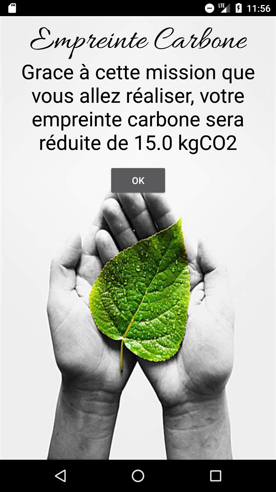

# Mission Climat app

An Android application that gives you small challenges (like taking public transportation for a week) and calculates by how much your carbon footprint was reduced if you agree to do the challenge.

  
  
  
  
  

# Context

This work is part of my Coding Weeks assignement. I learned java, OOP and android studio's basic features and models in the first week. 
Then in the second week, I made this app according to the theme which was climate and environment.
